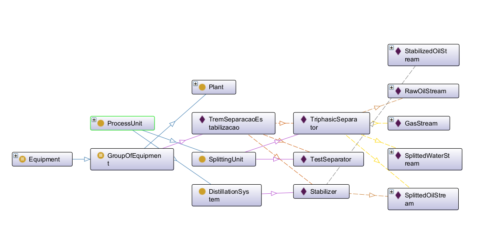

# ⚙️ FPSOEquipmentsOntology

A **FPSOEquipmentsOntology** é uma ontologia OWL desenvolvida para representar os principais **equipamentos**, **subsistemas** e **unidades funcionais** de um **FPSO (Floating Production, Storage and Offloading)**.

Ela visa fornecer uma estrutura semântica robusta e interoperável para modelar os sistemas físicos presentes em plataformas de produção offshore, com foco especial nas unidades de **separação trifásica** e **estabilização de óleo**.

---

## Base conceitual

Esta ontologia se baseia **parcialmente na OntoCAPE**, uma ontologia voltada para engenharia de processos, e a estende com classes específicas do contexto offshore.

### Ontologias importadas:
- `OntoCAPE UpperLevel`
- `OntoCAPE Chemical Engineering Core`
- `OntoCAPE System`
- ...

### Classes OntoCAPE reutilizadas:
- `ProcessUnit`
- `PieceOfEquipment`
- `Stream`
- `PlantItem`
- ...

---

## Novas classes e conceitos

### Equipamentos e Unidades Funcionais:
- **`Separator`**: unidade responsável por separar fases (óleo, gás, água), especialmente trifásica.
- **`Stabilizer`**: unidade de estabilização de óleo bruto.
- **`FlowLine`**, **`Valve`**, **`Heater`** e outras classes complementares.

### Tipos de Correntes (Streams):
- `RawOilStream`
- `GasStream`
- `StabilizedOilStream`
- `SplittedWaterStream`
- `SplittedOilStream`
- *(e outras especializações de `MaterialStream`)*

---

## Relações funcionais (Object Properties)

A ontologia define propriedades que descrevem a **dinâmica funcional** entre os equipamentos:

- `hasInputStream` — define o fluxo de entrada de uma unidade.
- `hasOutputStream` — define o fluxo de saída.
- `hasFunction` — associa uma função de processo ao equipamento.
- `feeds` — define encadeamento entre equipamentos.
- ...

Essas relações ajudam a representar o comportamento e interconexão dos equipamentos durante a operação.

---

## Exemplo: Trem de Separação e Estabilização

A ontologia inclui um exemplo instanciado de um **trem de separação e estabilização**, com base em uma configuração industrial real. O modelo inclui:

- Separadores trifásicos (`Separator`)
- Estabilizadores de óleo (`Stabilizer`)
- Linhas de escoamento (`FlowLine`)

Cada **indivíduo** é conectado logicamente a seus fluxos de entrada e saída, refletindo o caminho percorrido pela produção (óleo, gás e água).

---

## Diagrama ilustrativo

A imagem abaixo representa graficamente o arranjo modelado no exemplo `TremSeparacaoEstabilizacao`:

---

## 🛠️ Requisitos

- Protégé 5.6 ou superior
- OntoCAPE (disponível em: https://www.iai.kit.edu/)
